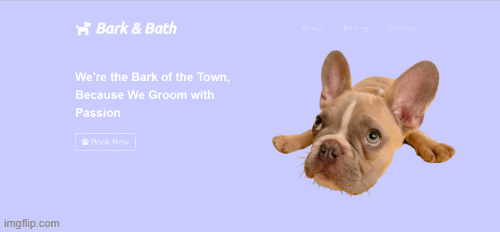

# Bark & Bath

This was one of the first projects I created before joining a bootcamp.
This project is a basic website that includes: html, css and bootstrap

This website has a landing page and two additional pages (About.html and BookNow.html). All the information is for a fictional dog parlour, but this is a reflection of what I would want to see from a website that is cost effective and done within a short matter of time.
The website gets to the point by; providing relevant imformation, it is easy to navigate and styled appropriately.

